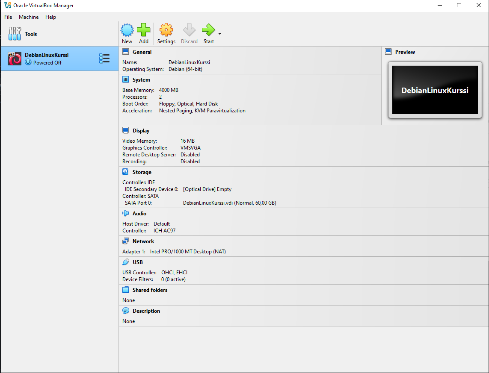
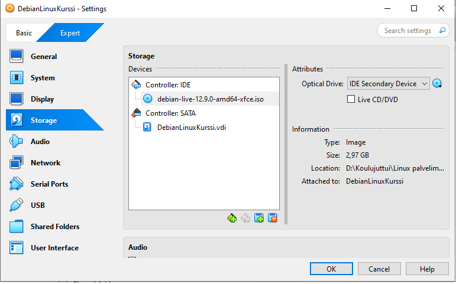
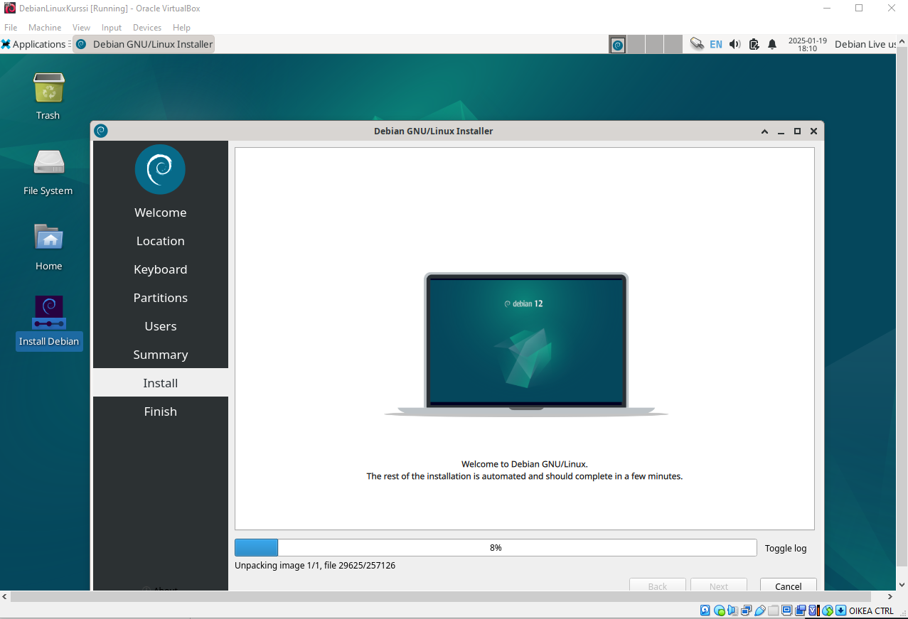
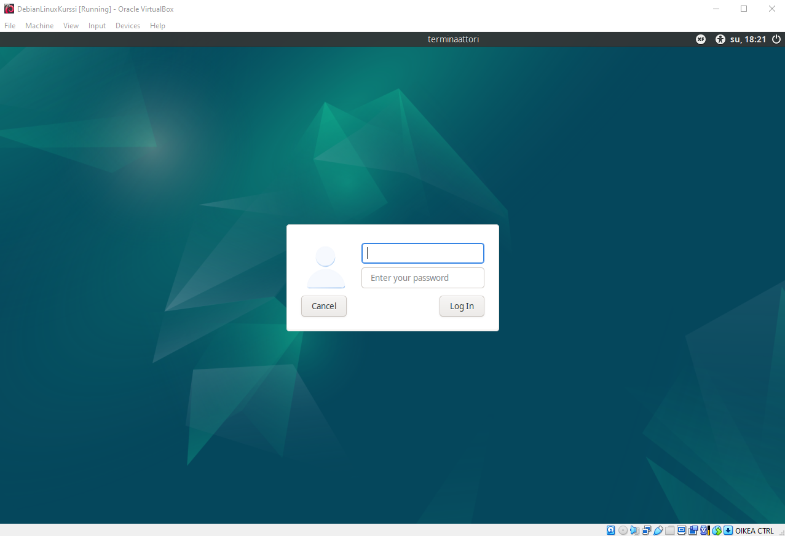
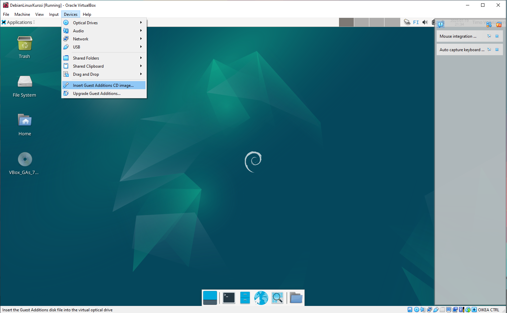
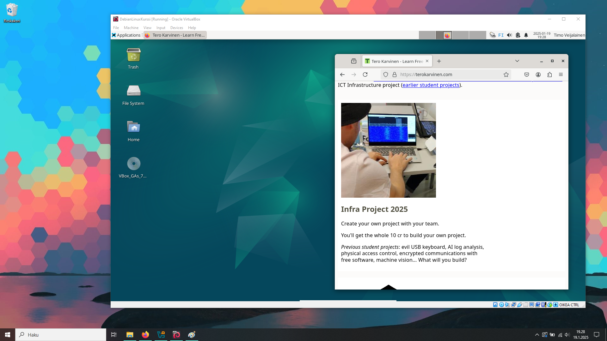

# h1 Oma Linux
## Raportin kirjoittaminen

Lähdeluettelo päivitetty 9.3.2025

Raportin täytyy olla toistettavissa sekä täsmällinen. Eli kerrotaan mitä ollaan tehty jä millä, jotta ulkopuolinen voi toistaa samat askeleet. Raportin täytyy myös olla helppolukuinen, sillä vaikealukuista raporttia on hankala sisäistää. Raportissa täytyy myös olla lähdeviittaukset eikä vilppiä saa harrastaa.

## What is Free Software artikkelin tiivistelmä.

Neljä välttämtöntä vapautta ovat seuraavat: vapaus käyttää ohjelmaa miten haluaa, vapaus tutkia ja muokata ohjelmaa, vapaus jakaa ohjelmaa sekä vapaus jakaa sinun muokkaamaa ohjelmaa muille.
Eli saat käyttää ohjelmaa miten haluat. Saat tehdä siihen muokkauksia miten haluat. Saat jakaa sitä sellaisenaan sekä saat jakaa muokkaamaasi versiota miten haluat. Muokattu versio pitää olla avoin muille käyttäjille. 

Vapaat ohjelmat voivat olla kaupallisia. Eli näitä saa käyttää kaupallisesti, mutta koodin pitää olla avointa.

## Linuxin asennus virtuaalikoneelle

Asensin virtuaalikoneen ja linuxin seuraavaa lähdettä käyttäen: Karvinen, Tero: 2025-01-14 oppitunnit Linux-palvelimet -kurssi. https://terokarvinen.com/2021/install-debian-on-virtualbox/

Käytin virtuaalikoneen asennukseen Oraclen VirtualBox manageria, jolla asensin virtuaalikoneen kannettavalle tietokoneelleni (Msi GE75 Raider 10sf), minkä käyttöjärjestelmänä toimii Windows 10 Home 64-bit. RAM-muistia koneessa on 16gb. Prosessori on Intel(R) Core(TM) i7-10750H CPU @ 2.60GHz (12 CPUs), ~2.6GHz

### Virtuaalikoneen asensin seuraavilla spekseillä n. klo 17:

#### Name and Operating System

Type: Linux

Subtype: Debian

Version: Debian (64-bit)

#### Hardware:

Memory Size: 4000 MB

Processors: 2

#### Hard Disk: 

Create a Virtual Hard Disk Now

Hard Disk size: 60 GB

Hard Disk File Type and Variant

VDI (VirtualBox Disk Image) - Pre-allovate Full Size (yes)

Paina "Finish"

Seuraavaksi lisäsin virtuaalikoneeseen virtuaalilsen cd-levyn, jonka latasin seuraavalta sivustolta: https://cdimage.debian.org/debian-cd/current-live/amd64/iso-hybrid/. Linkki löytyy aiemmin mainitusta lähteestä.

### Virtuaalikone toimii, joten seuraavaksi rupesin asentamaan debiania klo. 18. Askel askeleelta noudatin ohjeita.

### Debian Installeriin laitoin seuraavat asetukset:

Language: American/English

Location: Suomi/Helsinki

Keyboard: Finnish

Partitions: Erase Disk: Yes, Encrypt: No, Bootloader location: Master Boot Record of VBOX HARDDISK(/dev/sda)

Users: nimi, käyttäjä, tietokoneen nimi ja salasana.

Asennus näytti onnistuvan

Seuraavaksi kirjauduin järjestelmään ja varmistin toimivuuden käynnistämällä verkkoselaimen.
Tämän jälkeen avasin terminaalin, jossa suoritin seuraavat komennot: $ sudo apt-get update, $ sudo apt-get -y dist-upgrade, $ sudo apt-get -y install ufw, $ sudo ufw enable. Komennoilla päivitettiin järjestelmä ja asennettiin/otettiin palomuuri käyttöön. Seuraavaksi käynnistin virtuaalikoneen uudestaan. 

Seuraavaksi asensin Guest Additionin.
Eli ylälaidasta painoin "Devices" sieltä "Insert Guest Additions CD Image"

Tämän jälkeen ylälaidasta "Applications -> File Manager -> VBox_GAs_7.1.4 ja terminaaliin seuraavat komennot $ cd /media/*/VBox* -> $ ls -> $ sudo bash VBoxLinuxAdditions.run

Virtuaalikoneen ja linuxin asennus onnistui ilman ongelmia Tero Karvisen sivustolta löytyviä ohjeita noudattamalla. Aloitin asentelut klo. 17.00 ja lopetin 19.30. Asenteluiden ja raportin luomiseen meni noin tunti (välissä tuli tehtyä muita asioita).

## Reference

Karvinen, Tero 2025: Linux Palvelimet 2025 alkukevät, h1 Oma Linux: (https://terokarvinen.com/linux-palvelimet/)

Karvinen, Tero 2021: Install Debian on Virtualbox: (https://terokarvinen.com/2021/install-debian-on-virtualbox/)

The Free Software Foundation: (https://www.gnu.org/philosophy/free-sw.html#fs-definition)
