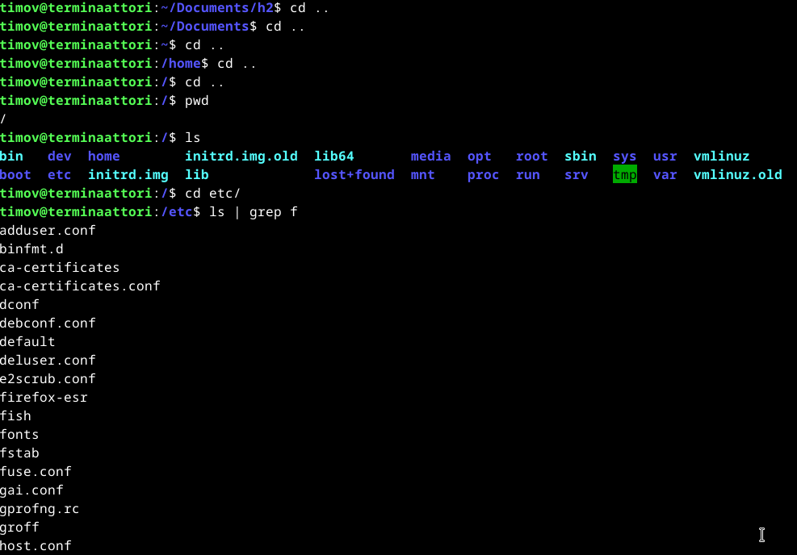

# h2 - Komentaja Pingviini
Tässä tehdään Tero Karvisen kurssimateriaalista löytyvää tehtävää nimeltä h2 - Komentaja Pingviini.
Pääasiallisesti tässä on käytetty Tero Karvisen kurssimateriaaleja, jotka löytyvät seuraavalta sivustolta: https://terokarvinen.com/linux-palvelimet/.

### x) Tiivistelmä - Command Line Basics Revisited

#### Liikkuminen ja tarkastelu
$ pwd - printtaa työskentely hakemiston ja tämän polun
$ ls - listaa tiedostot hakemistosta
$ cd "hakemisto"/ - vaihtaa hakemistoa
$ cd .. - ylemmälle tasole siirtyminen hakemisto polulla. (eli lähemmäs root/ hakemistoa)

#### Tiedoston käsittely
$ nano FOO.txt - luo FOO nimisen tekstitiedoston nano-tekstinkäsittely ohjelmalla.
$ mkdir NEWFOLDER - luo NEWFOLDER nimisen hakemiston (kansion)
$ mv OLDNAME NEWNAME- siirtää tai uudelleen nimeää hakemiston tai tiedoston. OLDNAMESTA tulee NEWNAME, vaikka NEWNAME niminen tiedosto olisi ollut jo olemassa.
$ cp -r ALKUPERÄINEN KOPIO - kopioi alkuperäisen hakemiston ja antaa nimeksi KOPIO
$ rm JUNK - poistaa "JUNK" nimisen tiedoston tai hakemiston.

#### Pakettien hallinta
$ sudo apt-get update - päivittää saatavilla olevat paketit

### a) Micro editorin asennus

Aloitin työskentelyn noin kello 18.20. Ensimmäiseksi avasin terminaalin ja päivitin ohjelmat komennolla "$ sudo apt-get update
". Seuraavaksi kokeilin asentaa microa komennolla "$ sudo apt install micro". Ilokseni huomasin, että micro ei asentunut sillä olin tämän jo aiemmin asentanut, eikä muita häiriö viestejä ilmaantunut, vaan komentotulkki ilmaisi, että ohjelma on jo asennettu uusimpaan versioon.

### b) 3 uutta komentorivi ohjelmaa

Käytin googlen hakukonetta seuraavalla haulla "commandline programs for linux" ja valitsin seuraavan linkin: "https://www.tecmint.com/command-line-tools/". Valitsin listalta seuraavat ohjelmat "Wikit, Boxes ja Figlet"

Avasin terminaalin ja yritin asentaa kaikki kolme ohjelmaa kerralla komennolla "$ sudo apt-get -y install wikit figlet boxes". Boxes ja Figlet asentui.
Tutkin asiaa ja selvisi, että wikit tarvitsee noden ja npm:n toimiakseen joten asensin nämä. komennolla "@ sudo apt install npm nodejs", jonka jälkeen pystyin asentamaan wikitin komennolla "$ sudo npm install wikit -g"

Seuraavaksi testailin juuri asentamiani ohjelmia. Aloitin Boxes ohjelmasta komennolla "", mikä näytti seuraavalta

Seuraavaksi käytin wikittiä komennolla "", mikä näytti seuraavalta:

Ja viimeisenä käytin Figlettiä komennolla "$ figlet LINUX KURSSI" , mikä näytti seuraavalta:

### c) Tärkeät kansiot

Aloitin tämän osion kello 20.20

Tärkeät kansiot löytyivät seuraavasta osoitteesta: "https://terokarvinen.com/2020/command-line-basics-revisited/"

#### "/" 
Root polku löytyi seuraavasti:

#### "/home/" 
Löytyi seuraavasti:

#### "/home/timov/" 
"home/" hakemistosta siirryttiin "timov/ hakemistoon komennolla "cd timov/". 

#### "/etc/" 
löytyi siten, että palasin "root" hakemistoon käyttämällä "cd .." komentoa kahdesti. Ja täältä "ls" komennolla pystyi näkemään, että täällä sijaitsee "etc/" hakemisto. Tähän navigoin komennolla "cd etc/"

#### "/media/" 
Hakemistoon menin seuraavasti. Aloitin siten, että tarkistin löytyykö "etc/" hakemistosta media kansiota kirjoittamalla komentotulkkiin "ls m" ja painamalla "tab" painiketta kahdesti.

Ei löytynyt, joten palasin "root/" hakemistoon "cd .." komentoa käyttäen ja kirjoitin komentotulkkiin "ls m" ja painoin "tab" painiketta kahdesti. Täältä löytyi "media/" hakemisto, johon navigoin "cd media/" komentoa käyttäen.

#### "var/log/"
Hakemiston löysin palaamalla "root" hakemistoon. Tänne, kun kirjoitti "cd v" ja tupla tab, niin "var/" hakemisto jo tarjoutukin. Tämän jälkeen piti vain lisätä "log/" ja enter.

### d) Grep-komento
Aloin tekemään tätä klo. 21.30

Teron Karvisen (https://terokarvinen.com/linux-palvelimet/) materiaalin pohjalta navigoin seuraavalle sivustolle "https://man7.org/linux/man-pages/man1/grep.1.html" Ja rupesin testailemaan grep-komentoa.
Tein grep-komentoa varten itseäni helpottavan tiedoston microlla documents/h2/ hakemistoon nimeltä "testaaja"

Alkuun en tahtonut tajuta miksen saa mitään komennosta irti. Joten avasin youtuben ja täältä seuraavasta videosta sain vähän työkaluja grepin käyttöön "https://www.youtube.com/watch?v=Tc_jntovCM0"

Hoksasinkin, etten ollut käyttänyt greppiä oikein. Eli olin yrittänyt hakea esim. -c (countilla) en mitään tiedostosta testaaja. komennolla "grep -c testaaja"

Hetken hämmästeltyäni tajusin sitten hakea jotain tiedostosta.
Käytin seuraavia komentoja:
"grep mansikka testaaja", Tällä löytyi 2 mansikkaa tiedostosta

"grep -c mansikka testaaja", Tämä laski, että tiedostosta löytyi 2 "mansikka" termiä.

"grep ma testaaja", Tämä näytti kaikki "ma" alkuiset objektit tiedostosta.

### e) Putkitus
ALoitin tämän osion klo. 22.00

Aloitin lukemalla putkista sivustolta: https://www.geeksforgeeks.org/piping-in-unix-or-linux/. Tässä vaiheessa voin myöntää, että en jaksa edes ymmärtää. Joten on aika kokeilla.
Aloitin omasta hakemistostani, jonka olin luonut tätä tehtävää varten.

Putkilla löysin testaajan. Seuraavaksi testasin etsiä vain "t" kirjainta putkella ja grepillä.

Eli putkilla voi siis etsiä tietoja hakemistoista ja yhdessä grepin kanssa voi tarkentaa hakuja. Kokeilin vielä "etc/" hakemistossa tätä.

Ainakin, jokin hahmotus aiheesta syntynyt.

### f) Rauta
Aloitin tämän osion noin klo. 23.00

Aloitin komennolla sudo apt-get -y install lshw, jolla asensin työkalun, jotta voisin tarkastella rautaani.
Tämän jälkeen käytin komentoa "sudo lshw -short -sanitize", jolla tulostin seuraavan listan.

Listasta ilmenee, että käyttöalusta on "virtualbox", ja hyvin pitkälti virutaalikoneen annetut arvot ovat ne mitä tästä listasta ilmenee. 4Gbit työmuistia, 64Gbit kovalevy tilaa (4Gbit taitaa mennä järjestelmään, kun olin itse laittanut 60Gbit käytettäväksi). Prosesori tiedot näköjään tulee isäntäkoneesta. Muuten kaikki näyttäisi aikalailla olevan virtuaalikoneen omia asetuksia.

## Lähteet

https://terokarvinen.com/2020/command-line-basics-revisited/

https://www.youtube.com/watch?v=Tc_jntovCM0

https://man7.org/linux/man-pages/man1/grep.1.html

https://www.geeksforgeeks.org/piping-in-unix-or-linux/

