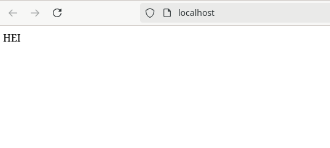
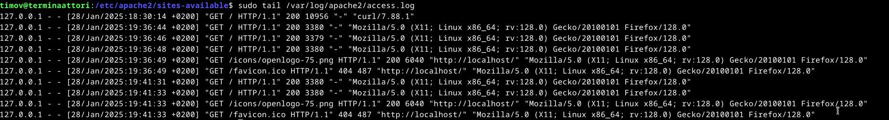
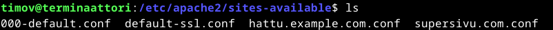
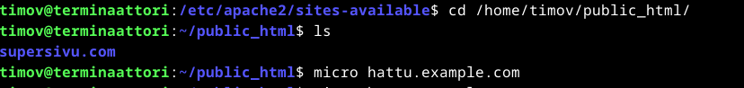
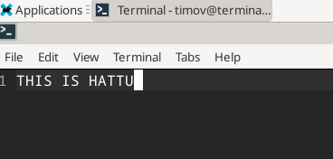

# h3_hello_web_server

### x) tiivistys

### a) Apachen asennus
Aloitin tämän klo. 17.30

Apachen asennus lähtee komennosta "$ sudo apt-get install apache2" Itse en tätä nyt tällä kertaa tehnyt, kun olin apachen jo asentanut aiemmin. Seuraava kuva tästä todisteena.

### b) Lokit
Aloitin tämän osion klo. 17.35

Lokitiedostoa "access.log" tutkin seuraavalla komennolla "sudo tail /var/log/apache2/access.log". "tail" komento tulostaa oletuksena tiedoston 10 viimeistä riviä.

Rivien tulkintata:

  Seuraavaksi tulkitsen kuvasta toisiksi ylintä riviä.

  "127.0.0.1" on IP osoite, mistä pyyntö on lähetetty.
  
  "-" on nimitunniste, koska tätä ei ole asetettu, niin on se "-".
  
  "[28/Jan/2025:19:36:44 +0200]" Kertoo pyynnön päivämäärän ja ajan.
  
  "GET" On pyynnön tyyppi. Tässä tapauksessa yritetään hakea jotain mitä, voidaan näyttää.

  "HTTP1/1" On protokolla
  
  "200" Pyynnön status, eli tässä tapuksessa pyyntö on onnistunut ja haluttu objekti näytetään.

  "3380" on palaavan objektin koko.

  "Mozilla/5.0" Tässä esiintyy selain, jolla pyyntö ollaan tehty.
  
  "(X11; Linux x86_64; rv:128.0)" Käyttöjärjestelmä, jolla pyyntö ollaan tehty.
  
  "Gecko/20100101" Alusta, johon selain perustuu, millä pyyntö ollaan tehty.
  
  "Firefox/128.0" Selaimen versio, jolla pyyntö ollaan tehty.

  Kuvassa näkyy myös kaksi status "404". Tämä tarkoittaa sitä, että asiaa mitä pyydettiin ei löydy. Kuvan tapauksessa, yritetään hakea jotain iconi kuvaa localhost osoitteesta. Ei löydy, kun ei tämmöistä sivustolle olle asetettukkaan.
  
### c) Etusivu uusiksi

Aloitin tämän osion 18.45

Ensiksi navigoin apachen "sites-available" hakemistoon komennolla "$ cd /etc/apache2/sites-available".

Tämän jälkeen tein microlla "sites-available" hakemistoon tiedoston nimeltä "hattu.example.com.conf" komennolla "micro hattu.example.com.conf".

Tiedostoon lisäsin seuraavat rivit ja tallensin tiedoston "ctrl+s" näppäinyhdistelmällä ja poistuin tiedostosta "ctrl+q" näppäinyhdistelmällä.

Tarkisin "ls" komennolla, että hakemistoon oli tullut "hattu.example.com.conf" niminen tiedosto.

Tämän jälkeen kävin tekemässä microlla tiedoston "hattu.example.com" hakemistoon "/home/timov/public_html/". Tiedostoon lisäsin tekstin "THIS IS HATTU"

### e) HTML5 sivu

### f) esimerkki "curl -I" ja "curl" komennosta

### Lähteet
https://terokarvinen.com/linux-palvelimet/
https://www.linux.fi/wiki/Portaali:Komentorivi
https://httpd.apache.org/docs/2.4/logs.html
https://developer.mozilla.org/en-US/docs/Web/HTTP/Headers/User-Agent/Firefox
