# h3_hello_web_server

### x) tiivistys

### a) Apachen asennus
Aloitin tämän klo. 17.30

Apachen asennus lähtee komennosta "$ sudo apt-get install apache2" Itse en tätä nyt tällä kertaa tehnyt, kun olin apachen jo asentanut aiemmin. Seuraava kuva tästä todisteena.

Testasin kuitenkin, toimivuutta tekemällä pyynnön omalla ip osoitteella. Eli kirjoitin konsoliin komennon "$ ip addr", josta sai oman ip osoitteen. Sitten lisäsin oman ip osoitteen komentoon "$ firefox 127.0.0.1"
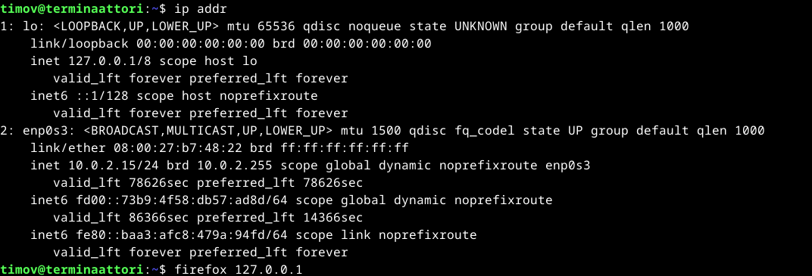

Tämä avasi localhostin ja sinne määritetyn sivuston, joten apache kyllä toimii.

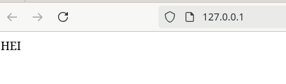

### b) Lokit
Aloitin tämän osion klo. 17.35

Lokitiedostoa "access.log" tutkin seuraavalla komennolla "sudo tail /var/log/apache2/access.log". "tail" komento tulostaa oletuksena tiedoston 10 viimeistä riviä.

Rivien tulkintata:

  Seuraavaksi tulkitsen kuvasta toisiksi ylintä riviä.

  "127.0.0.1" - on IP osoite, mistä pyyntö on lähetetty.
  
  "-" - on nimitunniste, koska tätä ei ole asetettu, niin on se "-".
  
  "[28/Jan/2025:19:36:44 +0200]" - Kertoo pyynnön päivämäärän ja ajan.
  
  "GET" - On pyynnön tyyppi. Tässä tapauksessa yritetään hakea jotain mitä, voidaan näyttää.

  "HTTP1/1" - On protokolla
  
  "200" - Pyynnön status, eli tässä tapuksessa pyyntö on onnistunut ja haluttu objekti näytetään.

  "3380" - on palaavan objektin koko.

  "Mozilla/5.0" - Tässä esiintyy selain, jolla pyyntö ollaan tehty.
  
  "(X11; Linux x86_64; rv:128.0)" - Käyttöjärjestelmä, jolla pyyntö ollaan tehty.
  
  "Gecko/20100101" - Alusta, johon selain perustuu, millä pyyntö ollaan tehty.
  
  "Firefox/128.0" - Selaimen versio, jolla pyyntö ollaan tehty.

  Kuvassa näkyy myös kaksi status "404". Tämä tarkoittaa sitä, että asiaa mitä pyydettiin ei löydy. Kuvan tapauksessa, yritetään hakea jotain iconi kuvaa localhost osoitteesta. Ei löydy, kun ei tämmöistä sivustolle olle asetettukkaan.
  
### c) Etusivu uusiksi

Aloitin tämän osion 18.45

Ensiksi navigoin apachen "sites-available" hakemistoon komennolla "$ cd /etc/apache2/sites-available".

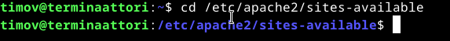

Tämän jälkeen tein microlla "sites-available" hakemistoon tiedoston nimeltä "hattu.example.com.conf" komennolla "micro hattu.example.com.conf".

Tiedostoon lisäsin seuraavat rivit ja tallensin tiedoston "ctrl+s" näppäinyhdistelmällä ja poistuin tiedostosta "ctrl+q" näppäinyhdistelmällä.

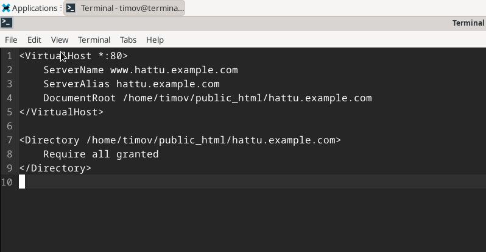

Tarkisin "ls" komennolla, että hakemistoon oli tullut "hattu.example.com.conf" niminen tiedosto.

Tämän jälkeen kävin tekemässä microlla tiedoston "hattu.example.com" hakemistoon "/home/timov/public_html/". Tiedostoon lisäsin tekstin "THIS IS HATTU" ("mkdir public_html" komennolla olin aiemmin tehnyt "public_html" hakemiston)

Seuraavaksi tarkistin, että minkä sivuston apache käy lukemassa komennolla "$ ls /etc/apache2/sites-enabled".

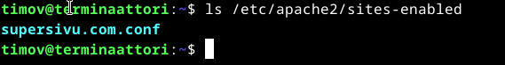

Näkyi, että tunnilla tehtty sivu on aktiivinen. Piti verestää muistia, että miten sivustot aktivoitiin/deaktivoitiin. Löysin vinkkiä seuraavalta sivustolta "https://www.linode.com/community/questions/311/how-do-i-enabledisable-a-website-hosted-with-apache". Komennot ovat seuraavat "$ a2ensite <sivu>" (aktivoi) ja "$ a2dissite <sivu>" (deaktivoi). Testataan sivuston deaktivointia komennolla "$ a2dissite supersivu.com.conf"

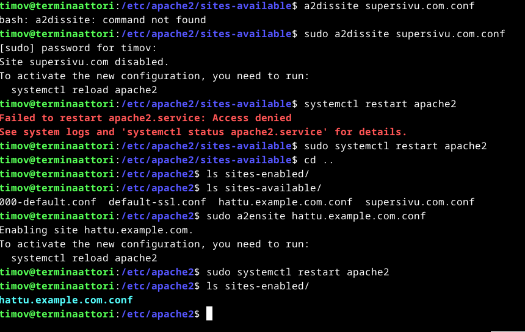

Kuten näkyy, ei toiminut, koska oli unohtunut "sudo" edestä. Korjasin komennon ja potkaisin apachen uusiksi käyntiin komennolla "$ sudo systemctl restart apache2". Sitten tarkistin, että onko supersivu.com aktiivinen komennolla "$ ls sites-enabled" (huom. olin hakemistossa "/etc/apache2/"). Mitään ei näkynyt, enään joten sivusto oli deaktivoitu onnistuneesti. Tämän jälkeen komennolla "$ sudo a2ensite hattu.example.com.conf" aktivoiin sivun. Sitten taas demonin potkaisu komennolla "$ sudo systemctl restart apache2" ja komennolla "$ ls sites-enabled/" tarkistus, että sivusto on aktivoitunut.

Sitten testasin miltä näyttää päivittää localhost selaimesta painamalla "shift + reload current page (Selaimessa hakupalkin vasemmalla puolella oleva ympyränmuotoinen nuolisymboli)"

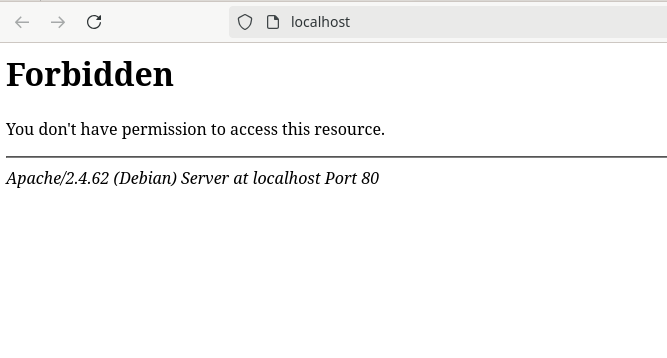

Ei toiminut, joten eikun selvittämään. Aloitin lokitiedostoja tutkimalla komennolla "$ sudo tail /var/log/apache2/access.log" Lokeista selvisi, apache ei suorita hakuja, koska lokit eivät päivittyneet, vaikka sivustoa yritti päivittää "shift + reload current page". 

Forbidden, joka tapauksessa viittaa siihen, että apache toimii. Tarkistin ensimmäiseksi configure tiedoston komennolla "$ micro /etc/apache2/sites-available/hattu.example.com.conf". Oikealta näytti. Sitten siirryin katsomaan itse sivusto rakennetta "/pubclic_html/" hakemistoon ja täälläpä se virhe olikin.

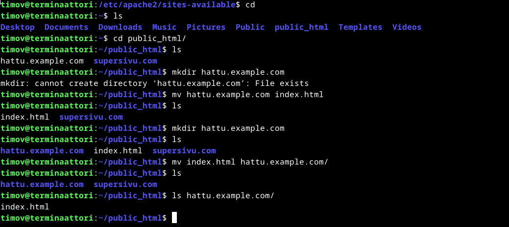

Eli olin vahingossa tehntyt "hattu.example.com" sivuston tiedostoksi "public_html" hakemistoon. Muutin "hattu.example.com" tiedoston "index.html" nimiseksi seuraavalla komennolla "$ mv hattu.example.com index.html". Tämän jälkeen tein hakemiston nimeltä "hattu.example.com" komennolla "$ mkdir hattu.example.com". Sitten siirsin "index.html" tiedoston hakemistoon "hattu.example.com" komennolla "$ mv index.html hattu.example.com/" Ja päivitin localhostin selaimesta.

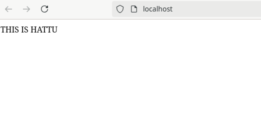

Vika selvitetty. Seuraavaksi piti selvitellä, että miten saan sivuston latautumaan "hattu.example.com" hakusanalla. Tero Karvisen, "https://terokarvinen.com/2018/04/10/name-based-virtual-hosts-on-apache-multiple-websites-to-single-ip-address/" Löytyikin ohjeet tähän. Eli komennolla "$ sudoedit /etc/hosts" pääsi lokaaliin nimipalveluun. Tänne lisättiin omalla ip osoitteella "hattu.example.com"

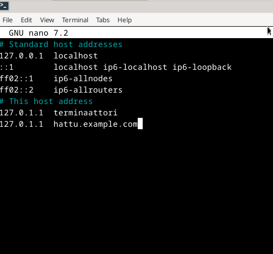

Listassa näkyi "terminaattori" kokeilin toimiiko

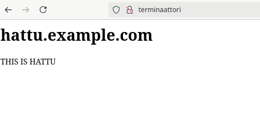

Toimihan se. Sitten vielä kokeilin seuraavalla haulla "hattu.example.com".

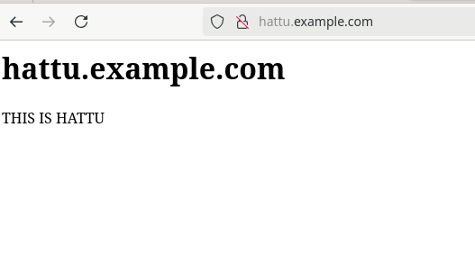

Tämäkin toimi.

### e) HTML5 sivu

### f) esimerkki "curl -I" ja "curl" komennosta

### Lähteet
https://terokarvinen.com/linux-palvelimet/
https://www.linux.fi/wiki/Portaali:Komentorivi
https://httpd.apache.org/docs/2.4/logs.html
https://developer.mozilla.org/en-US/docs/Web/HTTP/Headers/User-Agent/Firefox
