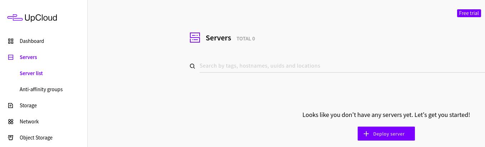

# Maailma Kuulee
Tehty 9.2.2025

Tässä työssä o

#### Rauta

### x) Tiivistelmä

### a) Virtuaalipalvelin
Aloitin tämän osion klo. 15.00

Vuokrasin virtuaaliapalvelimen seuraavalta sivustolta: "https://upcloud.com/"
Kun sain omat tiedot lisättyä sivustolle, niin aloitin kohdasta "servers" ja täältä painoin painiketta "Deploy server"

Palvelimelle kirjautumista varten generoin avainparin terminaalissa seuraavalla komennolla "$ ssh keygen", ja julkisen avaimen lisäsin "Login Methodiin" microa hyödyntäen. Ensiksi navigoin hakemistoon, jossa avain sijaitsee ja komennolla "$ micro id_rsa.pub" avasin tiedoston ja näppäinyhdistelmällä "ctrl+a" valitsin kaiken tekstitiedostosta ja yhdistelmällä "ctrl+c" kopioin tämän. Sitten lisäsin kyseisen rimpsun kirjautumis vaihtoehtoihin.

### b) alkutoimet

### c) weppipalvelin omalle virtuaalipalvelimelle

### d) 
