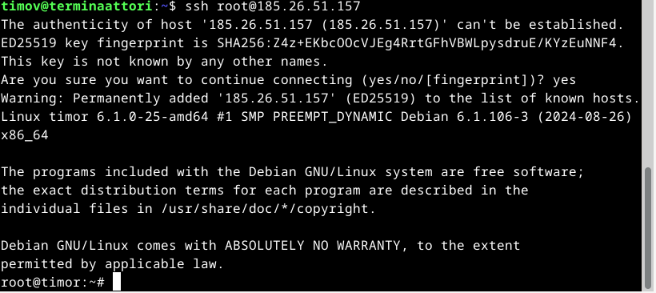
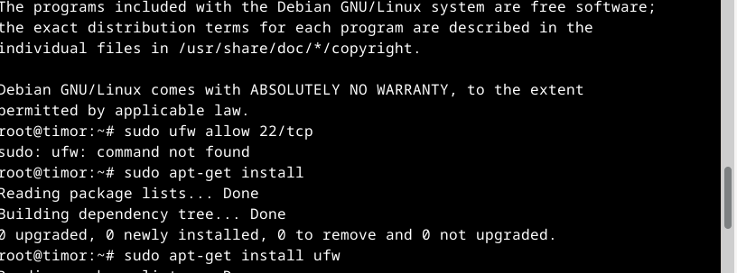
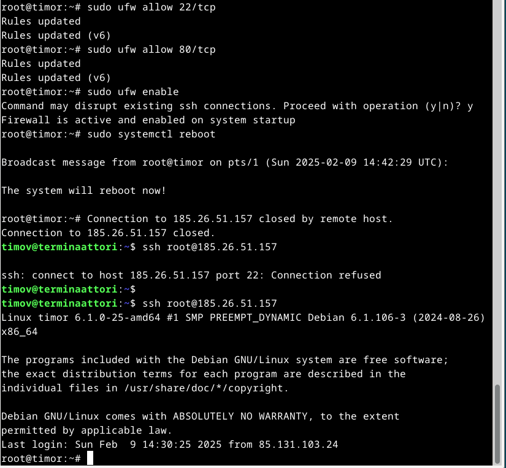
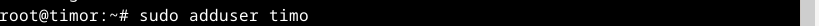
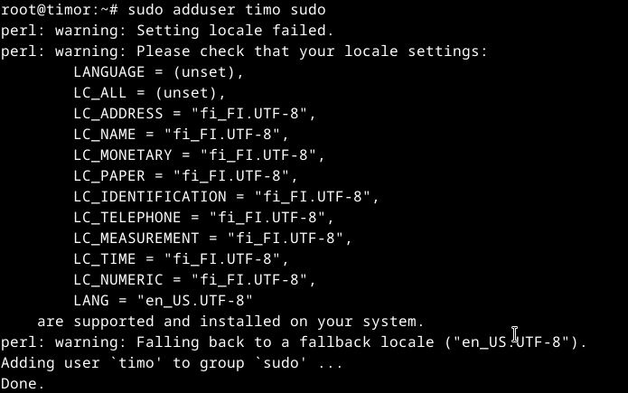
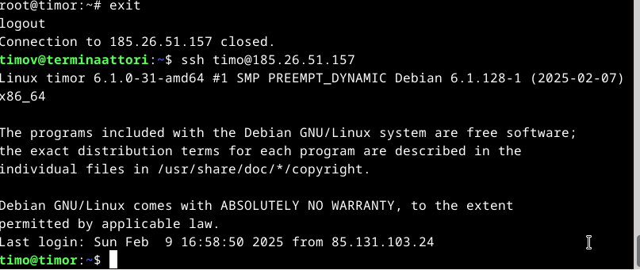
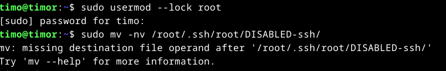
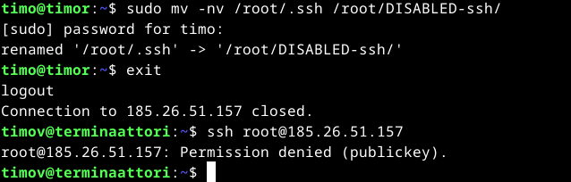

# Maailma Kuulee
Tehty 9.2.2025

Tässä työssä o

#### Rauta

### x) Tiivistelmä

### a) Virtuaalipalvelin
Aloitin tämän osion klo. 15.00

Vuokrasin virtuaaliapalvelimen seuraavalta sivustolta: "https://upcloud.com/"
Kun sain omat tiedot lisättyä sivustolle, niin aloitin kohdasta "servers" ja täältä painoin painiketta "Deploy server"

Laitoin seuraavat asetukset:

Lokaatio

Palvelimen speksit

Käyttöjärjestelmä

Kirjautumiskeino

Palvelimelle kirjautumista varten generoin avainparin terminaalissa seuraavalla komennolla "$ ssh keygen".  

Julkisen avaimen lisäsin "Login Methodiin" microa hyödyntäen. Ensiksi navigoin hakemistoon, jossa avain sijaitsee ja komennolla "$ micro id_rsa.pub" avasin tiedoston ja näppäinyhdistelmällä "ctrl+a" valitsin kaiken tekstitiedostosta ja yhdistelmällä "ctrl+c" kopioin tämän. Sitten lisäsin kyseisen rimpsun kirjautumis vaihtoehtoihin.

Palvelimen nimeäminen

Yhteenveto

Sitten käynnistin palvelimen "Deploy" painikkeesta ja sehän onnistui.

### b) alkutoimet

Aloitin tämän osion klo. 16.15

Lueskelin tarkemmin Tero Karvisen materiaalit aiheesta sivustolta, "https://terokarvinen.com/2017/first-steps-on-a-new-virtual-private-server-an-example-on-digitalocean/" sekä kävin läpi tehtävänannossa olevat vinkit ja lähdin etenemään.

Aloitin kirjautumalla palvelimelle komennolla "$ ssh root@185.26.51.157" IP osoite löytyi juuri perustamani palvelinpalvelun "servers/server list" välilehdeltä.

Seuraavaksi lähdin laittamaan palomuuria päälle. Aloitin sillä, että yritin jättää reiät palomuuriin komennolla "sudo ufw allow 22/tcp", ei onnistunut sillä en ollut asentanut palomuuria tai muitakaan paketteja. Joten aloitin sittenkin näillä toiminteilla. Eli aloitin komennolla "sudo apt-get install" ja jatkoin "sudo apt-get install ufw".

Sitten kokeilin laittaa uudestaan reikiä palomuuriin ennen tämän käynnistämistä. Neuroottisesti avasin vielä 80 portin komennolla "sudo ufw allow 80/tcp" Ja sitten laitoin palomuurin päälle "sudo ufw enable". Seuraavaksi boottasin palvelimen komennolla "sudo systemctl reboot".
Kirjauduin takaisin palvelimelle komennolla "$ ssh root@185.26.51.157" ja ajoin vielä seuraavat komennot varmuudeksi "sudo apt-get update" ja "sudo apt-get dist-upgrade", jotta varmasti kaikki on päivitetty.

Sitten lisäsin käyttäjän järjestelmään komennolla "sudo adduser timo" lisäsin käyttäjän sudo ryhmään komennolla "sudo adduser timo sudo".

Seuraavaksi kopioin root käyttäjän .ssh hakemiston uudelle käyttäjälle, jotta voisin tällä kirjautua jatkossa järjestelmään komennolla "cp -n -r /root/.ssh /home/timo/" "Sitten kokeilin kirjautua uudella käyttäjällä sisälle, ei onnistunut.

Aloin lukemaan opettajan vinkkiosiota ja täältä löytyi toinen komento "sudo chown -R timo:timo /home/timo/", jota kokeilin. Ja tämän jälkeen kirjautuminen omilla tunnuksilla onnistui.

Sitten lähdin sulkemaan root-tunnusta. Aloitin komennolla "sudo usermod --lock root" (olisi ehkä voinut testata voiko root-tunnuksella tehdä salasanaa vaativia toiminteita) ja tämän jälkeen käytin komentoa "sudo mv -nv /root/.ssh/root/DISABLED-ssh/".

Hyvä homma, että jälkimmäinne komento ei mennyt läpi. Korjasin komennon "sudo mv -nv /root/.ssh /root/DISABLED-ssh/" Eli lisäsin välilyönnin, jotta "root/.ssh" hakemisto muuttui seuraavaksi "root/DISABLED-ssh/". Eli nyt ei pitäisi olla .ssh hakemistoa rootilla, mistä hakea avainta. Näin ollen root-tunnuksen ei pitäisi enää toimia.

Eikä se toimikkaan!

### c) weppipalvelin omalle virtuaalipalvelimelle

### d) 
