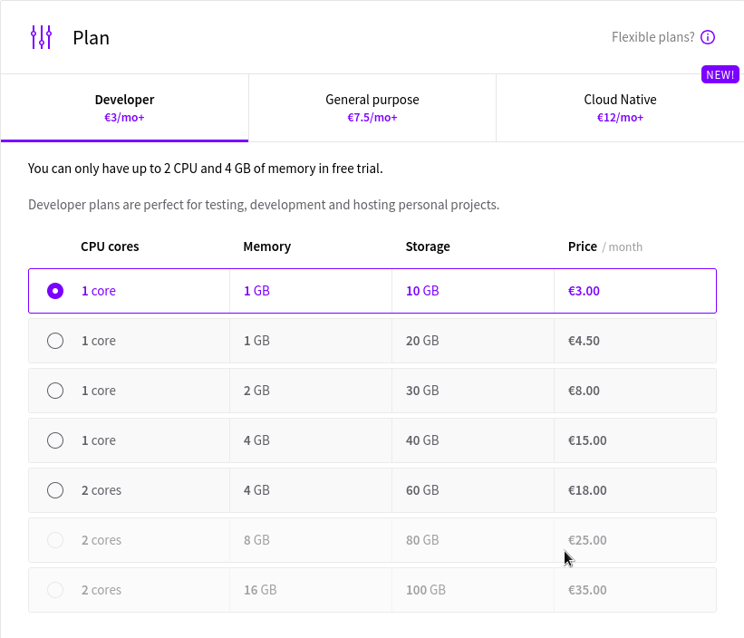

# Maailma Kuulee
Tehty 9.2.2025
Lähdeluettelo päivitetty 9.3.2025.

Tehtävää tehdessä on kätetty Tero Karvisen sivustolta löytyviä materiaaleja "https://terokarvinen.com/linux-palvelimet/".

### x) Tiivistelmä
#### Susanna Lehto 2022: Teoriasta käytäntöön pilvipalvelimen avulla (h4)
##### a) Pilvipalvelimen vuokraus ja asennus 
* GitHub educationin avulla opiskelija voi saada ilmaisen palvelimen DigitalOceanin kautta, ainakin väliaikaisesti.
* Namecheapilta voi saada domain nimen. Eli nimen, jolla voi osoitetta hakea verkosta.
* Tarkista ostoskorit, jotta voit olla varma ettei tule ikäviä yllätyksiä maksun yhteydessä.
##### d) Palvelin suojaan palomuurilla
* "$ ssh root@<palvelimen-ip>" komennolla kirjaudutaan palvelimelle.
* Reiät jätetään palomuuriin ennenkuin tämä käynnistetään.
##### e) Kotisivut palvelimelle
* Komennolla "$ sudo a2enmod userdir" aktivoidaan userdir-moduuli.
##### f) Palvelimen ohjelmien päivitys
* Komennoilla "$ sudo apt-get update", "$ sudo apt-get upgrade" ja "$ sudo apt-get dist-upgrade" päivitetään palvelimen ohjelmat.
* Ensiksi pitää kirjautua palvelimelle.

#### Tero Karvinen 2017: First Steps on a New Virtual Private Server – an Example on DigitalOcean and Ubuntu 16.04 LTS
* Reiän palomuuriin saat komennolla "$ sudo ufw allow 22/tcp"
* Palomuurin aktivoit komennolla "$ sudo ufw enable"
* Käyttäjän lisäät komennolla "$ sudo adduser <user>" ja sudo oikeudet annat komennolla "$ sudo adduser <user> sudo" (lisää käyttäjän sudo nimiseen ryhmään, jos on esim. ryhmä nimeltä admin. Vaihda sudo adminiksi "$ sudo adduser <user> admin").
* Muista päivittää kaikki komennoilla "$ sudo apt-get update" ja "$ sudo apt-get upgrade"
* Tapa poistaa root-tunnukselta salasanan käyttö "$ sudo usermod --lock root"
* Tapa poistaa root-tunnukselta kirjautuminen "$ sudoedit /etc/ssh/sshd_config" ja sieltä "PermitRootLogin no"

### a) Virtuaalipalvelin
Aloitin tämän osion klo. 15.00

Vuokrasin virtuaaliapalvelimen seuraavalta sivustolta: "https://upcloud.com/"
Kun sain omat tiedot lisättyä sivustolle, niin aloitin kohdasta "servers" ja täältä painoin painiketta "Deploy server"

Laitoin seuraavat asetukset:

Lokaatio

Palvelimen speksit

Käyttöjärjestelmä

Kirjautumiskeino

Palvelimelle kirjautumista varten generoin avainparin terminaalissa seuraavalla komennolla "$ ssh keygen".  

Julkisen avaimen lisäsin "Login Methodiin" microa hyödyntäen. Ensiksi navigoin hakemistoon, jossa avain sijaitsee ja komennolla "$ micro id_rsa.pub" avasin tiedoston ja näppäinyhdistelmällä "ctrl+a" valitsin kaiken tekstitiedostosta ja yhdistelmällä "ctrl+c" kopioin tämän. Sitten lisäsin kyseisen rimpsun kirjautumis vaihtoehtoihin.

Palvelimen nimeäminen

Yhteenveto

Sitten käynnistin palvelimen "Deploy" painikkeesta ja sehän onnistui.

### b) alkutoimet

Aloitin tämän osion klo. 16.15

Lueskelin tarkemmin Tero Karvisen materiaalit aiheesta sivustolta, "https://terokarvinen.com/2017/first-steps-on-a-new-virtual-private-server-an-example-on-digitalocean/" sekä kävin läpi tehtävänannossa olevat vinkit ja lähdin etenemään.

Aloitin kirjautumalla palvelimelle komennolla "$ ssh root@185.26.51.157" IP osoite löytyi juuri perustamani palvelinpalvelun "servers/server list" välilehdeltä.

Seuraavaksi lähdin laittamaan palomuuria päälle. Aloitin sillä, että yritin jättää reiät palomuuriin komennolla "sudo ufw allow 22/tcp", ei onnistunut sillä en ollut asentanut palomuuria tai muitakaan paketteja. Joten aloitin sittenkin näillä toiminteilla. Eli aloitin komennolla "sudo apt-get install" ja jatkoin "sudo apt-get install ufw".

Sitten kokeilin laittaa uudestaan reikiä palomuuriin ennen tämän käynnistämistä. Neuroottisesti avasin vielä 80 portin komennolla "sudo ufw allow 80/tcp" Ja sitten laitoin palomuurin päälle "sudo ufw enable". Seuraavaksi boottasin palvelimen komennolla "sudo systemctl reboot".
Kirjauduin takaisin palvelimelle komennolla "$ ssh root@185.26.51.157" ja ajoin vielä seuraavat komennot varmuudeksi "sudo apt-get update", "sudo apt-get upgrade ja "sudo apt-get dist-upgrade", jotta varmasti kaikki on päivitetty.

Sitten lisäsin käyttäjän järjestelmään komennolla "sudo adduser timo" lisäsin käyttäjän sudo ryhmään komennolla "sudo adduser timo sudo".

Seuraavaksi kopioin root käyttäjän .ssh hakemiston uudelle käyttäjälle, jotta voisin tällä kirjautua jatkossa järjestelmään komennolla "cp -n -r /root/.ssh /home/timo/" "Sitten kokeilin kirjautua uudella käyttäjällä sisälle, ei onnistunut.

Kävin uudestaan opettajan vinkkiosion lävitse ja täältä löytyi toinen komento "sudo chown -R timo:timo /home/timo/", jota kokeilin. Ja tämän jälkeen kirjautuminen omilla tunnuksilla onnistui.

Sitten lähdin sulkemaan root-tunnusta. Aloitin komennolla "sudo usermod --lock root" (olisi ehkä voinut testata voiko root-tunnuksella tehdä salasanaa vaativia toiminteita) ja tämän jälkeen käytin komentoa "sudo mv -nv /root/.ssh/root/DISABLED-ssh/".

Hyvä homma, että jälkimmäinne komento ei mennyt läpi. Korjasin komennon "sudo mv -nv /root/.ssh /root/DISABLED-ssh/" Eli lisäsin välilyönnin, jotta "root/.ssh" hakemisto muuttui seuraavaksi "root/DISABLED-ssh/". Eli nyt ei pitäisi olla .ssh hakemistoa root-tunnusta varten, mistä hakea avainta. Näin ollen root-tunnuksen ei pitäisi enää toimia.

Root-tunnus ei toiminut!

### c) weppipalvelin omalle virtuaalipalvelimelle
Aloitin tekemään tätä osiota klo. 20.00

Aloitin apachen asentamisesta palvelimelle komennolla "$ sudo apt-get install apache2"

Tämän jälkeen otin aikaisemman viikon raportin auki (https://github.com/veitim/linux-course/blob/main/h3_hello_web_server.md, tehty 2.2.2025) ja yritin toistaa samat toiminnot eri nimikkeillä.
Ensiksi tein uuden configure tiedoston komennolla "$ sudoedit /etc/apache2/sites-available/munsivu.conf.com". Tämän jälkeen tein kotihakemistoon "public_html" hakemiston ja sen sisälle sivusto hakemiston "munsivu.com" ja tämän sisälle index.html tekstitiedoston, jonne kirjasin "MUN SIVU!! AAAAAA".

Tämän jälkeen navigoin hakemistoon komennolla "cd /etc/apache2/sites-enabled" ja deaktivoin oletus sivun komennolla "$ sudo a2dissite 000-default.conf". ja tarkistin komennolla "$ ls /etc/apache2/sites-available" sivun, minkä halusin aktivoida. Ja yritin aktivoida oman sivuni komennolla "$ sudo a2ensite munsivu.conf.com". Ei toiminut. 

Unohdin ottaa kuvat täsät vaiheesta, mutta virhehän on tuo configure tiedosto, eli olen tehnyt "munsivu.conf.com", kun olisi pitänyt tehdä "munsivu.com.conf".

Toistin virheen jokatapauksessa tekemällä testitiedoston ".com" päätteellä ja yritin tämän aktivoida. Lopputulos oli seuraava. 

Korjauksen suoritin seuraavasti. Ensiksi navigoin hakemistoon "/etc/apache2/sites-available", jonka jälkeen käytin komentoa "$ sudo mv munsivu.conf.com munsivu.com.conf" ja tarkistin "$ sudoedit munsivu.com.conf".

Sitten lähdin testailemaan. Aloitin demonin potkaisulla "$ sudo systemctl restart apache2"

Jotain vikaa selkeästi, kun ei toimi, joten kokeilin vikailmoituksessa esiintyvää komentoa seuraavasti "sudo journalctl -xeu apache2.service"

Eli rivillä 7 tiedostossa "munsivu.com.conf" on jotain vikaa. Löytyi, kun avasi tiedoston komennolla "$ sudoedit /etc/apache2/sites-available/munsivu.com.conf"

Riviltä 7 puuttuu hakemistopolku. Lisäsin sen.

Kokeilin apachen uudeelleen käynnistystä "$ sudo systemctl restart apache2" se toimi, joten kokeilin sivustoa komennolla "$ curl localhost". Ei toiminut vaan antoi virheeksi "forbidden". Terminaaliin komento "$ sudo tail /var/log/apache2/error.log"

Tutkinnan jälkeen Tero Karvisen h3 tehtävän vinkkiosiosta löytyi apuja kohdasta "Kotisivu kielletty (403 Forbidden)?. Testasin komentoja "$ chmod ugo+x $HOME $HOME/public_html/" sekä "ls -ld $HOME $HOME/public_html/". Ja uudelleenkäynnistin apachen.

Lähti toimimaan. Kokeilin vielä selaimella sekä puhelimella kirjaamalla IP-osoitteen hakukenttään.

Mitä tästä opin on se, että tee pieni pala kerralla ja testaa tämän toiminta heti.

### Lähteet
Karvinen, Tero 2025: Linux Palvelimet 2025 alkukevät: (https://terokarvinen.com/linux-palvelimet/)

Karvinen, Tero 2017: First Steps on a New Virtual Private Server – an Example on DigitalOcean and Ubuntu 16.04 LTS: (https://terokarvinen.com/2017/first-steps-on-a-new-virtual-private-server-an-example-on-digitalocean/)

Lehto, Susanna 2022: Teoriasta käytäntöön pilvipalvelimen avulla (h4): (https://susannalehto.fi/2022/teoriasta-kaytantoon-pilvipalvelimen-avulla-h4/)

UpCloud Ltd 2025: (https://upcloud.com/)
