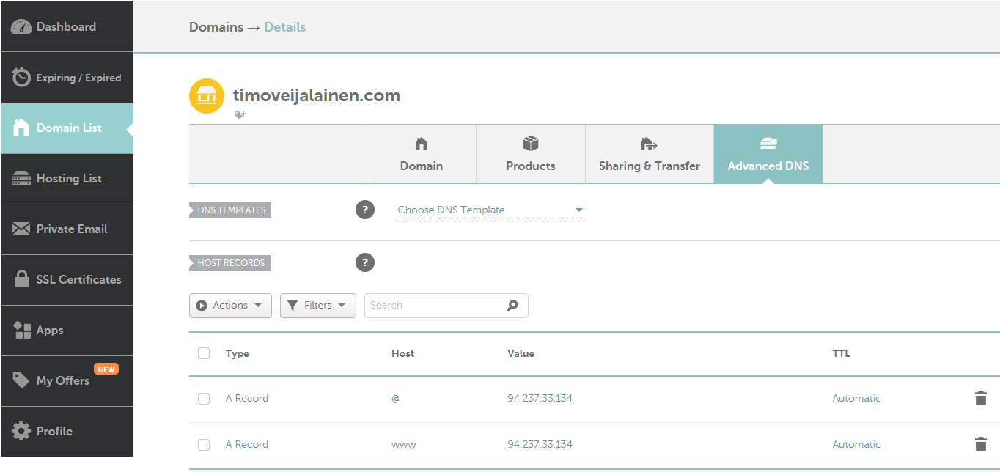
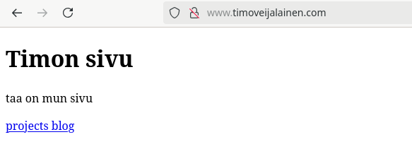
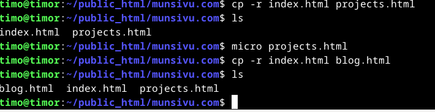
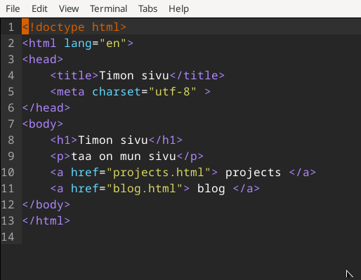
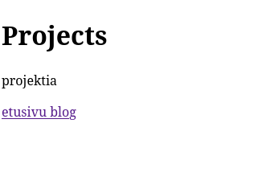

### a ja b) Nimi
Aloitin tämän osion 24.2.2025 klo. 19.00. namecheap sivuston huolto ohitse.

Elikkä käytin domain-nimeä varten namecheap sivustoa "https://www.namecheap.com/".

Tänne kävin laittamassa ohjaukset palvelimelleni käyttäen tämän ip-osoitetta. Sitten testasin, että voiko sivustolleni navigoida käyttäen domain-nimea "timoveijalainen.com"

Nimipalvelu pelaa.

### c)
Aloitin tästä osiosta, koska namecheap sivustolla oli huolto käynnissä. Aloitin tekemisen 24.2.2025 klo. 15.00

Tein alasivut "blog.html" ja "projects.html" munsivu.com hakemistoon, "index.html" oli jo aiemmin tehtynä. Html-pohjana on käytetty Tero Karvisen materiaaleista löytyvä HTML-5 sivupohja "https://terokarvinen.com/2012/short-html5-page/". Koska pystyin sivut tekemään ja näihin muokkauksia tekemään ilman sudoa, niin ymmärtääkseni nyt ei ole pääkäyttäjän oikeuksia käytetty.

Eli kopioin "index.html" ja tein tästä "projects.html". Samalla tapaa tein "blog.html" sivun. Tämän jälkeen kävin microlla muokkaamassa sivujen tekstejä ja lisäisin linkitykset.

### d)
### e)
