## h5_nimekäs
Tämä raportti on tehty 24.2.2025
Lähdeluetteloa päivitetty 9.3.2025

Tämän tehtävän aloituksessa oli lievästi ongelmia, sillä palvelimeni oli kadonnut upcloudista (krediitit olivat loppuneet, niin oletan tästä syystä tämän kadonneen) , joten jouduin tekemaan h4-tehtävän uudestaan. Ja vielä ilokseni namecheap palvelu, mitä halusin tätä tehtävää tehdessä käyttää oli huollettavana, mikä esti domainin vuokraamisen.

Tehtää tehtäessä olen käyttänyt enimmäkseen Tero Karvisen tekemiä oppimateriaaleja, mitkä löytyvät sivustolta: "https://terokarvinen.com/linux-palvelimet/".

### a ja b) Nimi
Aloitin tämän osion 24.2.2025 klo. 19.00. namecheap sivuston huolto ohitse.

Elikkä käytin domain-nimeä varten namecheap sivustoa "https://www.namecheap.com/".

Tänne kävin laittamassa ohjaukset palvelimelleni käyttäen tämän ip-osoitetta. Sitten testasin, että voiko sivustolleni navigoida käyttäen domain-nimea "timoveijalainen.com"

Nimipalvelu pelaa.

### c) Sivusto
Aloitin tästä osiosta, koska namecheap sivustolla oli huolto käynnissä. Aloitin tekemisen 24.2.2025 klo. 15.00

Tein alasivut "blog.html" ja "projects.html" munsivu.com hakemistoon, "index.html" oli jo aiemmin tehtynä. Html-pohjana on käytetty Tero Karvisen materiaaleista löytyvä HTML-5 sivupohja "https://terokarvinen.com/2012/short-html5-page/". Koska pystyin sivut tekemään ja näihin muokkauksia tekemään ilman sudoa, niin ymmärtääkseni nyt ei ole pääkäyttäjän oikeuksia käytetty.

Eli kopioin "index.html" ja tein tästä "projects.html". Samalla tapaa tein "blog.html" sivun. Tämän jälkeen kävin microlla muokkaamassa sivujen tekstejä ja lisäisin linkitykset.

### d) Alidomain
Aloitin tämän osion klo. 20.00

Kävin lisäämässä namecheappiin kaksi uutta "host" nimikettä advanced DNS osioon.

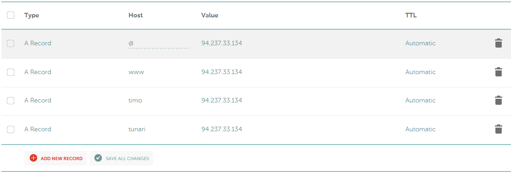

Eli "tunari" ja "timo" pitäisi nyt toimia jotenkin.

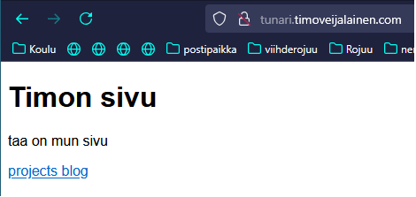

tunari.timoveijalainen.com ainakin ohjaa sivustoni etusivulle. (niin myös timo.timoveijalainen.com)
En varmaan nyt ole ymmärtänyt alidomainia oikein.

### e) tutkintaa "dig" ja "host" komennoilla.
Aloitin tämän osion klo. 20.20

Ensiksi menin www.linux.fi sivustolle ja hain tietoa dig ja host komennoista. Tämän jälkeen lähdin testailemaan komennolla "$ dig timoveijalainen.com" 

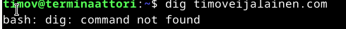

Eli komentoa ei ole, joten jotain täytyy asentaa. Hakukoneeseen haku "how to install dig on linux" Tällä haulla tuli seuraava komento "sudo apt-get install dnsutils" Ainakin pienin tutkimsen jälkeen näyttää ihan aidolta.

Asennus toimi ja komento "$ dig timoveijalainen.com" näyttää seuraavalta

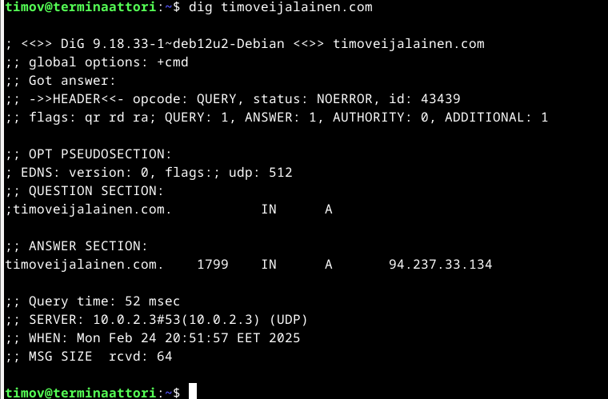

Komento "$ host timoveijalainen.com" näyttää seuraavalta

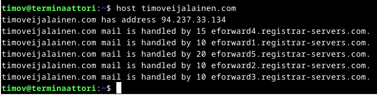

Ja sitten tutkailin samoilla komennoilla namecheap sivustoa.

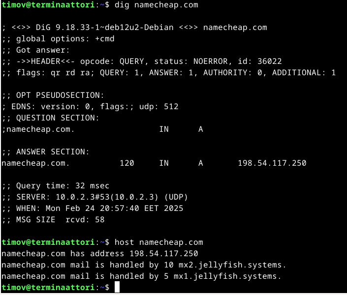

Seuraavaksi tutkailin Tero Karvisen sivustoa "terokarvinen.com"

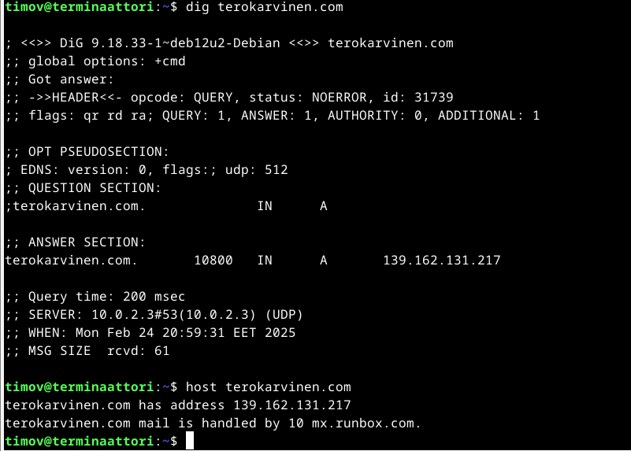

Viimeiseksi tutkin sivustoa "youtube.com"

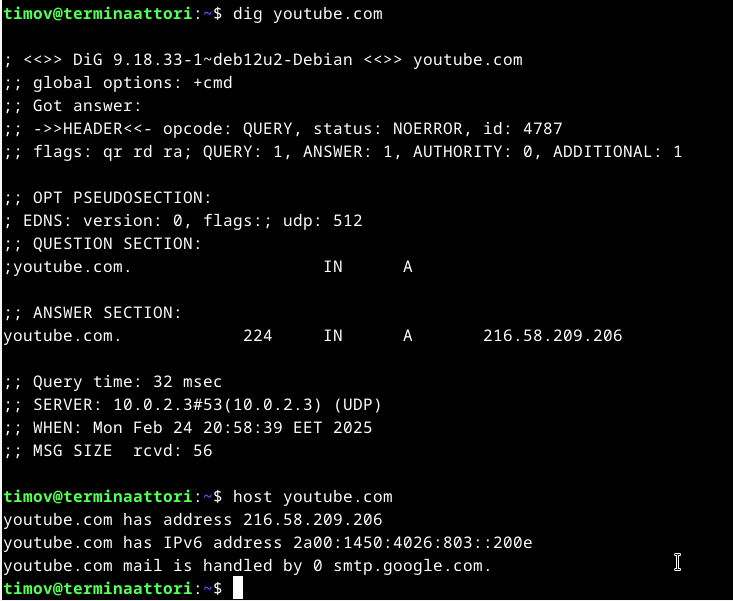

Host komennolla ainakin näkee nimeä vastaavan ip-osoitteen sekä sähköpostipalvelun.

Dig komennon tuloksia en osannut juurikaan kommentoida, joten tutkin tehtävänannon vinkkiosiota ja sieltä löytyikin komento "man dig". Komento "man dig" avaa "dig" komentoa koskevan käyttöoppaan. Lueskelin tätä ja sitten vielä seuraavalta sivustolta löysin lisä apua: "https://www.howtogeek.com/663056/how-to-use-the-dig-command-on-linux/"

Suoritin haut uudestaan käyttäen "any" liitettä. 

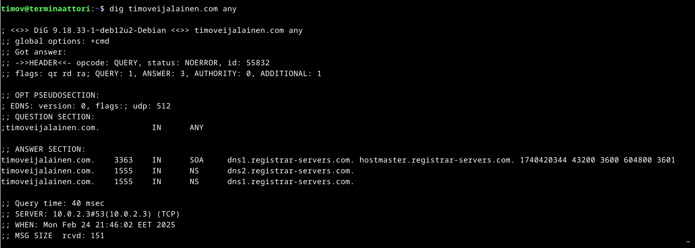

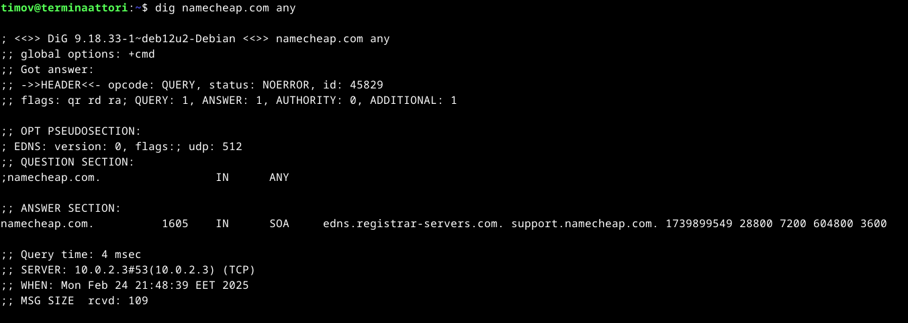

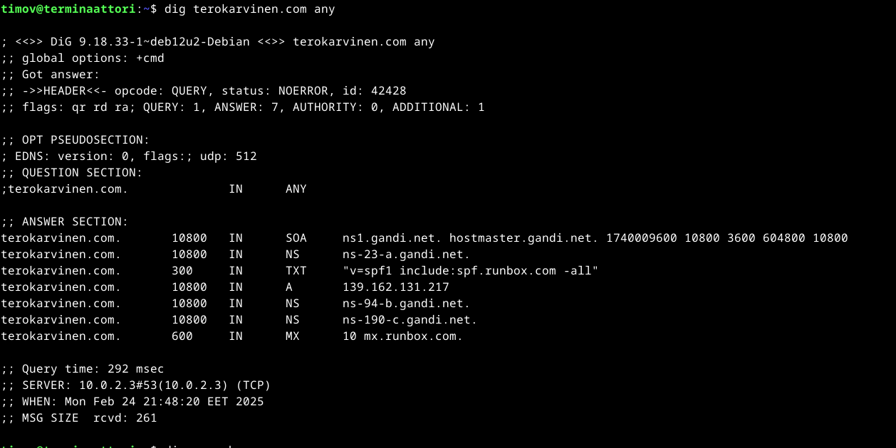

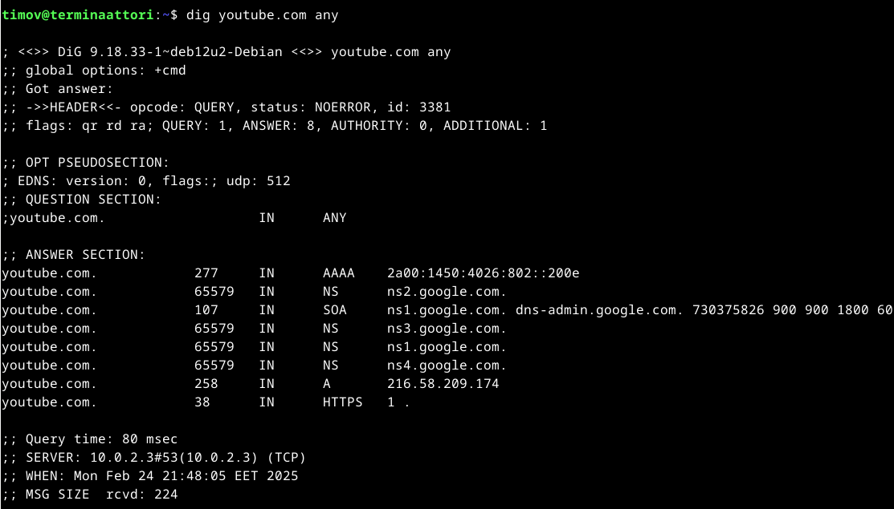

Elikkäs ns-tietue viittaa subdomainiin tai domainin delegointiin (uudelleen ohjaus?), eli omalla sivulla on 2 ns tietuetta, mikä pitää paikkansa "timo" ja "tunari". Namecheapilla ei yhtään. Tero Karvisen sivustolla on ns-tietuieta 3 ja youtubella 4.

A-tietue ei näy "any" komennolla namecheap.com tai timoveijalainen.com kohdalla, mutta tämä on palvelimen ip-osoite.

TXT-tietue on tekstitiedosto liittyen domainiin. Voidaan käyttää vähentämään haittasähköpostia. Terokarvinen.com sivustolla näyttäisi yksi tämmöinen olevan.

SOA-tietue valtuutuksen alkutietueet voivat sisältää paljon tietoa verkkotunnuksesta. Täältä löydät ensisijaisen nimipalvelimen, vastuuosapuolen, muutosten aikaleiman, vyöhykkeen päivitysten tiheyden sekä joukon aikarajoja uudelleenyrityksille ja hylkäämisille suora lainaus käännettynä sivulta "https://www.howtogeek.com/663056/how-to-use-the-dig-command-on-linux/"

MX-tietue viittaa sähköpostiin, samat tiedot näkyi host komennolla, jostain syystä vain terokarvinen.com sivustolla näkyym mx-tietue "dig +any" komentoa käyttäen.

AAAA-tietue youtube.com näyttää IPv6 osoitteen.

### Lähteet

Karvinen, Tero: (Linux Palvelimet 2025 alkukevät: https://terokarvinen.com/linux-palvelimet/)

McKay, Dave 2024: (https://www.howtogeek.com/663056/how-to-use-the-dig-command-on-linux/)

Linux.fi: (https://www.linux.fi/wiki/Etusivu)

Namecheap, INC: (https://www.namecheap.com/)

Karvinen, Tero 2012: (https://terokarvinen.com/2012/short-html5-page/)
