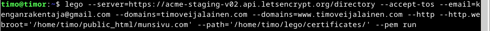
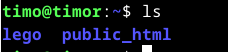
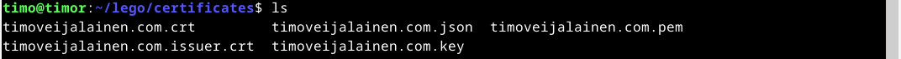
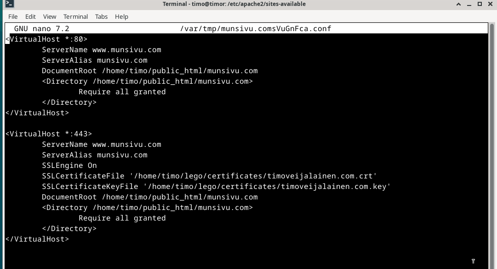
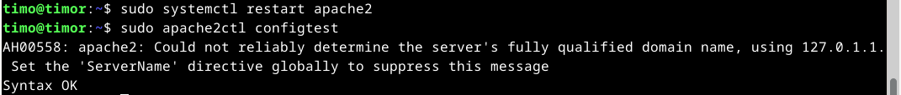
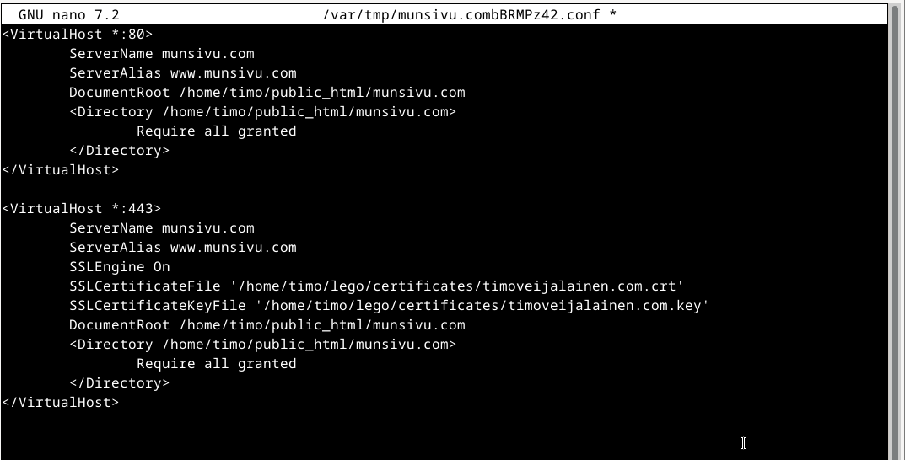
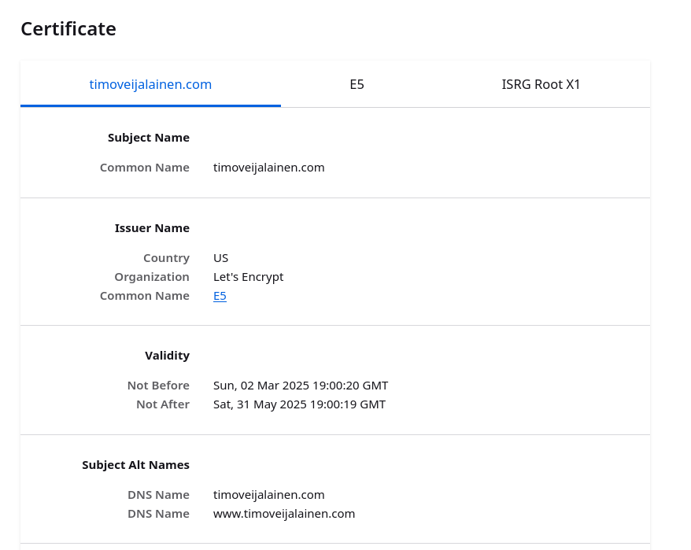
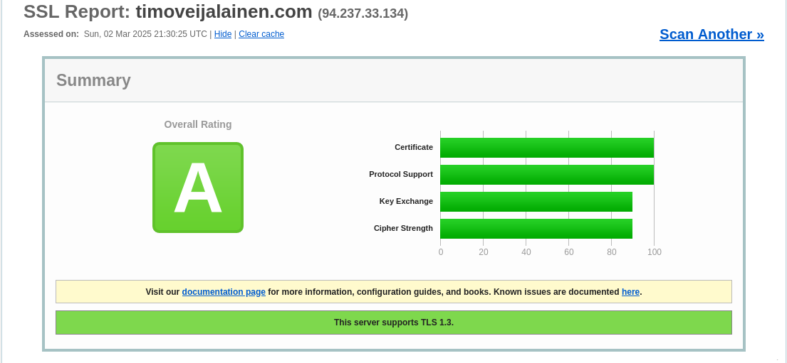
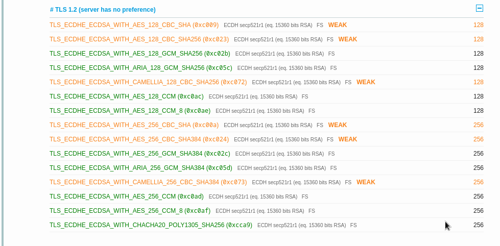

## h6 Salataampa

Isäntäkone:

* Malli: Msi GE75 Raider 10sf
* OS: Windows 10 Home 64-bit
* RAM: 16gb
* CPU: Intel(R) Core(TM) i7-10750H CPU @ 2.60GHz (12 CPUs), ~2.6GHz
* GPU: NVIDIA GeForce RTX 2070
* BIOS: E17E9IMS, 10A

Virtuaalikone:
* OS: Debian/GNU Linux 12 (bookworm) x84_64
* RAM: 4gb
* CPU: 2 processor
* GPU: 128 MB

### x) tiivistys

#### How It Works - Let's Encrypt

https://letsencrypt.org/how-it-works/

#### Obtain a Certificate

https://go-acme.github.io/lego/usage/cli/obtain-a-certificate/index.html#using-an-existing-running-web-server

#### SSL/TLS Stron Encryption

https://httpd.apache.org/docs/2.4/ssl/ssl_howto.html#configexample

### a) TLS-sertifikaatti

Tässä tehtävässä hain sertifikaatin sivustolleni sivustolta https://letsencrypt.org/.

Ensimmäinen askel oli tarkistaa, että sivusto toimii. Eli navigoin osoitteeseen "timoveijalainen.com" ja tämän jälkeen ajoin komennon "$ sudo systemctl restart apache2". Päivitin selainta ja totesin, että palvelin pelittää. Sitten asensin legon komennolla "$ sudo apt-get install lego".

Seuraavaksi tutkin Tero Karvisen materiaaleja, ja luennolla ottamia screenshotteja. 

Komennolla:
"$ lego --server=https://acme-staging-v02.api.letsencrypt.org/directory --accept-tos --email=kenganrakentaja@gmail.com --domains=timoveijalainen.com --domains=www.timoveijalainen.com --http --http.webroot='/home/timo/public_html/munsivu.com' --path='/home/timo/lego' --pem run" Suoritin sertifikaatin testihaun. Mikä onnistui.

Poistin "lego" hakemiston komennolla "$ -rm -r lego", ja suoritin lego komennon ilman "--server=...." alkuosaa.

Tämän jälkeen menin muokkaamaan virtualhost configure -tiedostoa mikä löytyy polusta "/etc/apache2/sites-available". Tarkistin samalla, että kirjoitin polut oikein.

Seuraavaksi otin sertifikaatin käyttöön komennolla "$ a2enmod ssl" Sitten Potkaisin demonia "$ sudo systemctl restart apache2" ja testasin configuraatiot komennolla "$ sudo apache2ctl configtest"

ServerNamessa jotain. Kävin muokkaamassa ja potkaisin palvelinta.

Vieläkin vikaa, muistinkin tässä vaiheessa, että tuo 443 portti pitää avata palomuurista. Joten ajoin komennon "$ sudo ufw allow 443/tcp" ja potkaisin palvelinta. Sama herjaus toistui vieläkin, mutta sertifikaatti toimii.

"https://timoveijalainen.com/"

### b) A-rating

Tässä tehtävässä testaan sivustoni tls-luokitusta käyttäen sivustoa "https://www.ssllabs.com/ssltest/"

Testin tulos oli A

CAA on

Seuraavat weak tulokset selittyvät

 "fatalhandshake error" Chrome 49 version kanssa. En kuitenkaan näe tässä ongelmaa sillä kyseinen versio on vanha.

### Lähteet:

https://terokarvinen.com/linux-palvelimet/

https://letsencrypt.org/how-it-works/

https://go-acme.github.io/lego/usage/cli/obtain-a-certificate/index.html#using-an-existing-running-web-server

https://httpd.apache.org/docs/2.4/ssl/ssl_howto.html#configexample

https://letsencrypt.org/

https://www.ssllabs.com/ssltest/
