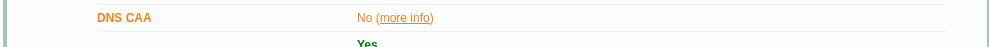

## h6 Salataampa

Raportti kirjoitettu 2.3.2025 - 3.3.2025

Isäntäkone:

* Malli: Msi GE75 Raider 10sf
* OS: Windows 10 Home 64-bit
* RAM: 16 GB
* CPU: Intel(R) Core(TM) i7-10750H CPU @ 2.60GHz (12 CPUs), ~2.6GHz
* GPU: NVIDIA GeForce RTX 2070
* BIOS: E17E9IMS, 10A

Virtuaalikone:
* OS: Debian/GNU Linux 12 (bookworm) x84_64
* RAM: 4 GB
* CPU: 2 processor
* GPU: 128 MB

### x) tiivistys

#### How It Works - Let's Encrypt

* Käyttää ACME protokollaa, jolla saadaan sertifikaatti ilman ihmiskontaktia.
* Muodostaa avainparin, jolla let's encrypt tunnistaa palvelimen haltijan
* Avainta hyödyntäen voidaan jatkaa sertifikaattia tai peruuttaa tämä

https://letsencrypt.org/how-it-works/

#### Obtain a Certificate - Using an existing, running web server
*Jos on palvelin toiminnassa portissa --http tarvitsee myöst --http.webrootin

https://go-acme.github.io/lego/usage/cli/obtain-a-certificate/index.html#using-an-existing-running-web-server

#### SSL/TLS Strong Encryption - Basic Configuration Example
Seuraavat asetukset pitää löytyä virtualhostista:
* Portti 443 pitää olla käytössä
* ServerName "palvelimen nimi"
* SSLEngine On
* SSLCertificateFile <polku mistä löytyy .cert/crt tiedosto">
* SSLCertificateKeyFile <polku mistä löytyy .key tiedosto">

https://httpd.apache.org/docs/2.4/ssl/ssl_howto.html#configexample

### a) TLS-sertifikaatti

Aloitin tämän osion klo. 21.00

Tässä tehtävässä hain sertifikaatin sivustolleni sivustolta https://letsencrypt.org/.

Ensimmäinen askel oli tarkistaa, että sivusto toimii. Eli navigoin osoitteeseen "timoveijalainen.com" ja tämän jälkeen ajoin komennon "$ sudo systemctl restart apache2". Päivitin selainta ja totesin, että palvelin pelittää. Sitten asensin legon komennolla "$ sudo apt-get install lego".

Seuraavaksi tutkin Tero Karvisen materiaaleja, ja luennolla ottamia screenshotteja. 

Komennolla:
"$ lego --server=https://acme-staging-v02.api.letsencrypt.org/directory --accept-tos --email=kenganrakentaja@gmail.com --domains=timoveijalainen.com --domains=www.timoveijalainen.com --http --http.webroot='/home/timo/public_html/munsivu.com' --path='/home/timo/lego' --pem run" Suoritin sertifikaatin testihaun. Mikä onnistui.

Poistin "lego" hakemiston komennolla "$ -rm -r lego", ja suoritin lego komennon ilman "--server=...." alkuosaa.

Tämän jälkeen menin muokkaamaan virtualhost configure -tiedostoa mikä löytyy polusta "/etc/apache2/sites-available". Tarkistin samalla, että kirjoitin polut oikein.

Seuraavaksi otin sertifikaatin käyttöön komennolla "$ a2enmod ssl" Sitten Potkaisin demonia "$ sudo systemctl restart apache2" ja testasin configuraatiot komennolla "$ sudo apache2ctl configtest"

ServerNamessa jotain. Kävin muokkaamassa ja potkaisin palvelinta.

Vieläkin vikaa, muistinkin tässä vaiheessa, että tuo 443 portti pitää avata palomuurista. Joten ajoin komennon "$ sudo ufw allow 443/tcp" ja potkaisin palvelinta. Sama herjaus toistui vieläkin, mutta sertifikaatti toimii.

"https://timoveijalainen.com/"

Valmis klo. 22.00

### b) A-rating

Aloitin tämän osion klo. 22.30

Tässä tehtävässä testaan sivustoni tls-luokitusta käyttäen sivustoa "https://www.ssllabs.com/ssltest/"

Testin tulos oli A

P.Hallam-Baker sanoo DNS CAA:sta seuraavaa:

   The Certification Authority Authorization (CAA) DNS Resource Record
   allows a DNS domain name holder to specify one or more Certification
   Authorities (CAs) authorized to issue certificates for that domain.
   CAA Resource Records allow a public Certification Authority to
   implement additional controls to reduce the risk of unintended
   certificate mis-issue.  This document defines the syntax of the CAA
   record and rules for processing CAA records by certificate issuers.
   
Eli voisin halutessani määrittää mitkä tahot voivat sivustolleni sertifikaatteja myöntää. En näe tätä tarpeelliseksi. 

Seuraavat weak tulokset ovat tls 1.2:sta mitkä ovat todennäköisesti vanhenemassa, kun ollaan jo tls 1.3. Eli en näe ongelmaa, kun kaikki tls 1.3 testit ovat mennee hyvin läpi.

 Fatalhandshake error Chrome 49 version kanssa. En kuitenkaan näe tässä ongelmaa sillä kyseinen versio on vanha.

Valmis 23.00

### Lähteet:

https://terokarvinen.com/linux-palvelimet/

https://letsencrypt.org/how-it-works/

https://go-acme.github.io/lego/usage/cli/obtain-a-certificate/index.html#using-an-existing-running-web-server

https://httpd.apache.org/docs/2.4/ssl/ssl_howto.html#configexample

https://letsencrypt.org/

https://www.ssllabs.com/ssltest/

https://datatracker.ietf.org/doc/html/rfc6844
