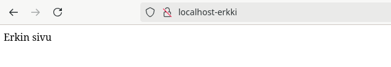
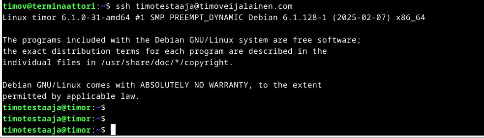

# h7 Maalisuora

Raportti kirjoitettu 9.3.2025, klo 15.50 - Välisenä aikana

Raportissa on käytetty Tero Karvisen Linux Palvelimet -kurssin materiaaleja, jotka löytyvät seuraavalta sivulta: https://terokarvinen.com/linux-palvelimet/.

Tehtävät on tehty seuraavalla laittestolla,

Isäntäkone:

* Malli: Msi GE75 Raider 10sf
* OS: Windows 10 Home 64-bit
* RAM: 16 GB
* CPU: Intel(R) Core(TM) i7-10750H CPU @ 2.60GHz (12 CPUs), ~2.6GHz
* GPU: NVIDIA GeForce RTX 2070
* BIOS: E17E9IMS, 10A

Virtuaalikone:
* OS: Debian/GNU Linux 12 (bookworm) x84_64
* RAM: 4 GB
* CPU: 2 processor
* GPU: 128 MB

### a) Kirjoita ja aja "Hei maailma" kolmella kielellä
Tämä osio aloitettu klo. 16:00

Aloitin lukemalla Tero Karvisen tehtävänannon vinkkiosiosta löytyvää linkkiä: https://terokarvinen.com/2018/hello-python3-bash-c-c-go-lua-ruby-java-programming-languages-on-ubuntu-18-04/. Linkistä löyty kaikki tarpeellinen tehtävän suorittamista varten.

Päätin tehdä ajaa heimaailman pythonilla, bashilla ja c++. Asensin pythonin ja c++ komennolla "$ sudo apt-get install python3 g++" Bashia ei tarvinnut erikseen asentaa.
Tein heimaailma tiedostot microlla.

Pythoninilla heimaailman tulostus onnistui kirjoittamalla tekstitiedostoon print("Hei maailma!"), ja tämä sitten ajettiin komennolla "$ python3 heimaailma.py" (heimaailma.py, koska tämä on tiedoston nimi). 

Kuvassa olen käyttänyt "cat" komentoa tekstitiedoston tulostukseen.

Bashilla heimaailma tiedoston päätteksi tuli ".sh", ja tekstitiedostoon lisäsin rivin 'echo "hei maailma!"'. Luin tiedoston komennolla "$ bash heimaailma.sh"

C++ poikkesi enemmän aikaisemmista siten, että täytyi lisätä enemmän tekstiä ja tiedosto piti muuttaa komennoksi. Komennolla "$ g++ heimaailma.cc -o heimaailmacc" teki tekstitiedostosta komennon, jonka pystyi suorittamaan komennolla "./heimaailmacc"

Eli c++ vaati kirjaston "iostream", mikä haetaan "include" ja "std::cout" tarvitaan, jotta tekstiä voidaan tulostaa.

Valmis klo. 16.30

### c) Laita Linuxiin uusi, itse tekemäsi komento niin, että kaikki käyttäjät voivat ajaa sitä.

Aloitin tämän osion klo. 17.30 

Tehtävän a, aikana tein uuden komennon nimeltä "heimaailmacc", joten käytin tätä komentoa tähän tehtvään.

testasin komentoa "./heimaailmacc"

Toimi kuten piti. Seuraavaksi säädin komennon oikeuksia "chmod ugo+x heimaailmacc" komennolla, eli annoin kaikille käyttäjille execute oikeudet. chmod = komento jolla oikeuksia säädetään, u = user, g = group, o = others, + lisää, x = execute ja heimaailmacc = tiedosto/kansio mille oikeuksia määritetään.

Tarkisin, että oikeudet näyttävät hyvältä "$ ls -l" komennolla. Tällä komennoilla voi tarkastella aktiivisen hakemiston sisällön oikeuksia.

heimaailmacc:n oikeudet näyttävät hyvältä, eli x näkyy kaikissa ryhmissä. Kaikki voi siis komentoa suorittaa. Seuraavaksi kopioin komennon paikkaan, josta kaikki sitä voi myös käyttää. Komento oli "$ sudo cp heimaailmacc /usr/local/bin/" Komento löytyi Tero Materiaaleista linkistä "https://terokarvinen.com/2007/12/04/shell-scripting-4/" 

Testasin, että komento toimii oman hakemiston ulkopuolelta. Menin root juureen asti ja kokeilin.

Toimii tarkistin vielä hakemiston minne siirsin komennon.

Olinkin jo aiemmin tunnilla tehnyt toimivan komennon. Näyttää hakemistosta löytyvän kanssa kurssin alussa asentamani wikit ohjelma.

Valmis klo. 18.15

### d) Ratkaise vanha arvioitava laboratorioharjoitus soveltuvin osin.

Aloitin tämän osion klo. 20.00

Löysin seuraavan laboratorio harjoituksen: Final Lab for Linux Palvelimet 2023: (https://terokarvinen.com/2023/linux-palvelimet-2023-arvioitava-laboratorioharjoitus/?fromSearch=linux%20palvelimet%20lab), joista tein kohdat d-g.

A ja B tehtävät ovat raportointia, mitä teen tätä tehdessä kokoajan, joten jätän väliin. Tehtävä H aluetta ei ole kurssilla käsitelty, joten jätän tämänkin väliin.

#### "c" "Ei kolmea sekoseiskaa"
Tein tätä varten raportti -nimisen tiedoston microlla. Komennolla "$ chmod go-rwx raportti" Otin group, ja others ryhmiltä kaikki oikeudet pois.

Oikeuksien tarkastus komennolla "$ ls -l raportti"

Ei pitäisi olla muilla, kun "timov" käyttäjällä oikeudet raporttiin, joten tein uuden käyttäjän nimeltä turbo komennolla "$ sudo adduser turbo".
Avasin uuden terminaalin, missä kirjauduin turbo käyttäjällä sisään (komennolla: "$ su turbo"). Testasin, että voiko turbolla käsitellä raportti tiedostoa.

Ei voinut.

Käyttäjällä timov pystyi. Joten raportti salattu muilta käyttäjiltä. Huomioitavaa kyllä on se, että turbo pääsi käyttäjän timov hakemistoihin. Olisi hyvä säätää oikeudet siten, että vain timov käyttäjällä on pääsy timovin hakemistoihin tieturvasyistä.

#### "d" 'hey'

Eli tein tiedoston nimeltä hey, minne lisäsin "#!/bin/bash" ja "date" (date komento näyttää ajan). Annoin kaikille käyttäjille suoritus (execute tai x) oikdeudet tiedostoon "$ chmod ugo+x hey" ja ajoin komennolla "./hey".

Tämän jälkeen kopioin komennon hakemistoon mistä kaikki sitä voi ajaa komennolla "sudo cp hey /usr/local/bin/"

Sitten kokeilin ohjelmaa turbo käyttäjällä turbon kotihakemistosta.

Hyvin toimi.

#### "e" 1000x nano

Micron asensin komennolla "$ sudo apt-get install micro"

Micro oli entuudestaan asennettu ja eikä näköjään mitään päivitettävääkään ollut. Sitten plugineita selvittämään.

Löysin seuraavasta linkistä: (https://github.com/micro-editor/plugin-channel) "wc" pluginin, joka laskee rivit, sanat ja merkit"

Asensin pluginin komennolla "$ micro -plugin install wc". Komento löytyi youtubevideosta (https://www.youtube.com/watch?v=oZY8hl4dqqg) timemark: "0:36"

Käytin pluginia siten, että avasin tekstitiedoston ja painoin F5-painiketta.

Alapalkista näkee, että plugini toimii, kun luvut näyttävät oikeilta. 

#### "f" Stattisesti sinun
Avasin tätä osiota varten oman raporttini "https://github.com/veitim/linux-course/blob/main/h3_hello_web_server.md"

Apachen asennus toimii "$ sudo apt-get install apache2"

Käyttäjän erkki lisääminen toimii komennolla "$ sudo adduser erkki" ja nimeksi annetaan Erkki Esimerrki. Tein erkin kotihakemistoon käyttäjänä erkki public_html hakemiston ja tämän sisälle erkki.com hakemiston minne lisäsin "index.html" tiedoston tekstillä erkin sivu.

Pääkäyttäjänä lisäsin "etc/apache2/sites-available" hakemistoon erkki.com.conf tiedoston mihin lisäsin seuraavat tiedot:

Komennolla "$ sudo a2ensite erkki.com.conf" otin sivun käyttöön ja seuraavaksi tarkistin sivut mitkä olivat aktiivisena komennolla "ls /etc/apache2/sites-enabled". Ja komennolla "sudo a2dissite hattu.example.com.conf" otin toisen sivun pois käytöstä ja tämän jälkeen potkaisin demonia "sudo systemctl restart apache2".

Annoin erkkinä erkin kotihakemistolle komennolla "$ chmod ugo+rwx erkki" oikeudet, jotta apache2 pääsee tänne käsiksi ja voi sivuston lukea (tämä oikeassa ympäristössä väärin, koska nyt myös muut käyttäjät pääsevät erkin hakemistoon vapaasti).  

Lisäsin lokaaliin nimipalvelu tiedostoon kentän omalla IP-osoitteella "localhost-erkki" komennolla, "$ sudoedit /etc/hosts"

Sitten navigoin firefox-selaimella "http://localhost-erkki" sivustolle.

Näyttäisi toimivan.

#### "g" Salattua hallintaa

Oma palvelin löytyy ja olen kertaalleen tämän alusta tehnyt, niin en tässä viitsi uudestaan tätä toistaa (Tällä raportilla pystyy palvelimen asentamaan https://github.com/veitim/linux-course/edit/main/h4_maailma_kuulee.md)

Komennolla "ssh-keygen" luodaan salainen avain, joka sitten viedään palvelimen asetuksiin. Tämä hoituu seuraavasti, ensiksi navigoin hakemistoon, jossa avain sijaitsee "/.ssh" ja komennolla "$ micro id_rsa.pub" pääsin käsiksi julkiseen avaimeen. Sitten "ctrl+a" ja "ctrl+c" kopioin julkisen avaimen, joka viedään palvelimen kirjautumisvaihtoehtoihin. 

 (upcloudista palvelin)

Palvelimelle uuden käyttäjän voi luoda "sudo adduser timotestaaja". Uudellakäyttäjällä voi kirjautua palvelimelle kopioimalla .ssh hakemiston uuden käyttäjän hakemistoon, eli tässä tapauksessa se kävi komennolla "sudo cp -n -r /home/timo/.ssh /home/timotestaaja/".

Palvelimelle pääsee uudella käyttäjällä. 

Vaihdoin SSH-palvelimen kuuntelemaan porttiin 1337/tcp seuraavasti. Löysin sivustolta (https://www.geeksforgeeks.org/how-to-change-the-default-ssh-port-in-linux/) ohjeet tähän. Eli, navigoin "/etc/ssh/" hakemistoon ja komennolla "sudoedit ssh_config" avasin configure tiedoston johon kävin vaihtamassa port 22 kohtaa port 1337. Tätä ennen avasin palomuurista portin komennolla "sudo ufw allow 1337/tcp"

Potkaisin demonia ja käynnistin palvelimen uudestaan komennolla "$ sudo systemctl restart ssh"

Näyttäisi toimivan.

Valmis 23.00

### e) Asenna itsellesi tyhjä virtuaalikone arvioitavaa labraa varten.

### Lähteet:

Karvinen, Tero 2025: Linux Palvelimet 2025 alkukevät - h7 Maalisuora: (https://terokarvinen.com/linux-palvelimet/)

Karvinen, Tero 2018: Hello World Python3, Bash, C, C++, Go, Lua, Ruby, Java – Programming Languages on Ubuntu 18.04: (https://terokarvinen.com/2018/hello-python3-bash-c-c-go-lua-ruby-java-programming-languages-on-ubuntu-18-04/)

Karvinen, Tero 2007: Shell Scripting: (https://terokarvinen.com/2007/12/04/shell-scripting-4/)

Karvinen, Tero: Final Lab for Linux Palvelimet 2023: (https://terokarvinen.com/2023/linux-palvelimet-2023-arvioitava-laboratorioharjoitus/?fromSearch=linux%20palvelimet%20lab)

Micro-Editor: plugin-channel: (https://github.com/micro-editor/plugin-channel)

Unkert, Timothy W 2023: How to Install Plugins in the Micro Text Editor: Videolinkki: (https://www.youtube.com/watch?v=oZY8hl4dqqg"
